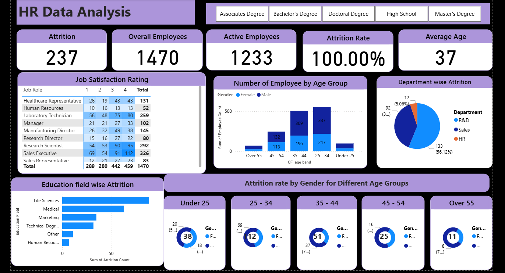

<h1 style="color:#6a1b9a;">HR Data Analysis – Power BI Dashboard</h1>

<h2>
Project Title: <strong>HR Analytics & Attrition Insights Dashboard</strong>
</h2>

<strong>Introduction:</strong> 
As a <strong>Data Analyst</strong>, I designed and developed an interactive <strong>Power BI dashboard</strong> to analyze key HR metrics such as employee attrition, workforce demographics, job satisfaction, and department-wise trends.  
This dashboard enables HR teams and business leaders to make <strong>data-driven workforce decisions</strong> by identifying patterns, risks, and improvement areas across the organization.

<h2>📊 Dashboard Overview</h2>

  

    
  

<h2>📌 Key Metrics & KPIs</h2>
<ul>
  <li><strong>Total Employees:</strong> Overall workforce count</li>
  <li><strong>Active Employees:</strong> Currently working employees</li>
  <li><strong>Attrition Count:</strong> Employees who left the organization</li>
  <li><strong>Attrition Rate:</strong> Percentage of employee turnover</li>
  <li><strong>Average Age:</strong> Workforce age distribution insight</li>
</ul>

<h2>📈 Detailed Analysis & Insights</h2>

<h3>1️⃣ Job Satisfaction Analysis</h3>
<ul>
  <li>Analyzed satisfaction ratings across different job roles</li>
  <li>Identified roles with high and low satisfaction levels</li>
  <li>Helps HR teams improve engagement strategies</li>
</ul>

<h3>2️⃣ Employee Age Group Distribution</h3>
<ul>
  <li>Employees segmented into age groups</li>
  <li>Gender-wise comparison within each age group</li>
  <li>Supports workforce planning and retention strategies</li>
</ul>

<h3>3️⃣ Department-wise Attrition</h3>
<ul>
  <li>Attrition comparison across HR, Sales, and R&D departments</li>
  <li>Highlights departments with higher employee turnover</li>
</ul>

<h3>4️⃣ Education Field-wise Attrition</h3>
<ul>
  <li>Analyzed attrition based on educational background</li>
  <li>Identified high-risk education domains</li>
</ul>

<h3>5️⃣ Attrition Rate by Gender & Age Group</h3>
<ul>
  <li>Gender-based attrition analysis across age bands</li>
  <li>Helps identify vulnerable employee segments</li>
</ul>

<h2>🛠 Tools & Technologies Used</h2>
<ul>
  <li><strong>Power BI</strong> – Interactive dashboard & visualizations</li>
  <li><strong>DAX</strong> – Measures and calculated KPIs</li>
  <li><strong>Excel (HR Data.xlsx)</strong> – Data cleaning & preprocessing</li>
</ul>

<h2>🎯 Business Impact</h2>
<ul>
  <li>Improves understanding of employee attrition patterns</li>
  <li>Supports HR decision-making and retention planning</li>
  <li>Provides clear visibility into workforce demographics</li>
  <li>Enables proactive HR strategies using data insights</li>
</ul>

<h2>📂 Repository Contents</h2>
<ul>
  <li><strong>HRproject.pbix</strong> – Power BI dashboard file</li>
  <li><strong>HR-Data_Dashbord.png</strong> – Dashboard screenshot</li>
  <li><strong>HR Data.xlsx</strong> – Source dataset</li>
  <li><strong>README.md</strong> – Project documentation</li>
</ul>

<h2>👤 Author</h2>
<strong>Shivam Pawar</strong> 
Aspiring Data Analyst | Power BI | SQL | Excel | Python  

🔗 <strong>LinkedIn:</strong> <a href="https://www.linkedin.com/in/shivampawar">https://www.linkedin.com/in/shivampawar</a> 
🔗 <strong>GitHub:</strong> <a href="https://github.com/shivamp6159">https://github.com/shivamp6159</a> 
📧 <strong>Email:</strong> shivamp6159@gmail.com

<h2>📌 GitHub Topics</h2>

powerbi • data-analysis • hr-analytics • dashboard • business-intelligence • portfolio-project

<h3>Conclusion</h3>
This <strong>HR Analytics Power BI Dashboard</strong> delivers a comprehensive view of workforce dynamics and attrition behavior.  
It is designed to help organizations enhance employee retention, improve satisfaction, and make informed HR decisions using data. 🌍📊
